# DATA SCIENCE

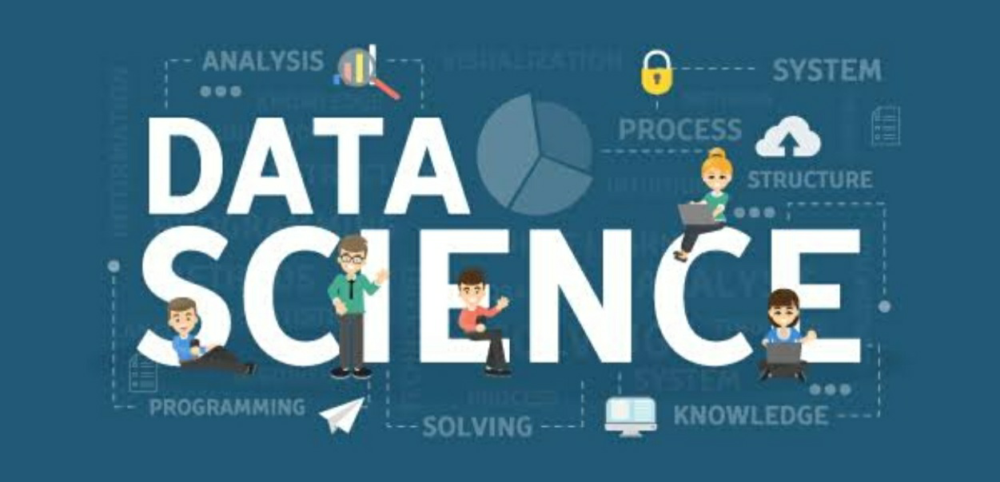

## What is Data Science?

Before defining data science, let’s get familiarized with three terms – **data, information and insight**. These three terms seem similar; however, they are not quite the same.

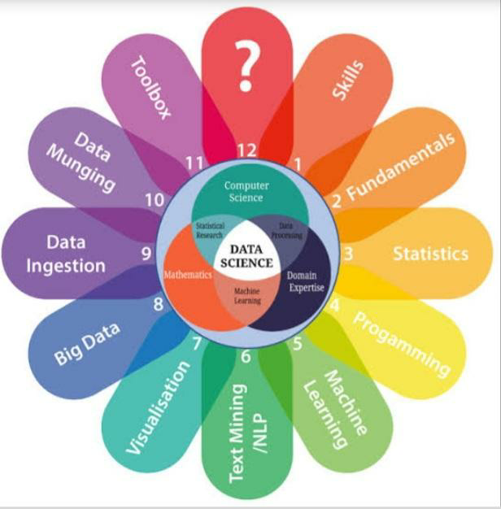

- **DATA** is a raw unorganized set of information. What we call data is actually raw data. It contains information; however, the information is not readily available.
- **INFORMATION** is when you analyze data so that it provides some sort of understanding of the data. The term we use is information extraction (from data).
- **INSIGHT** is gained by analyzing data and information to understand what is going on with a particular situation. This can be used to make better decisions.

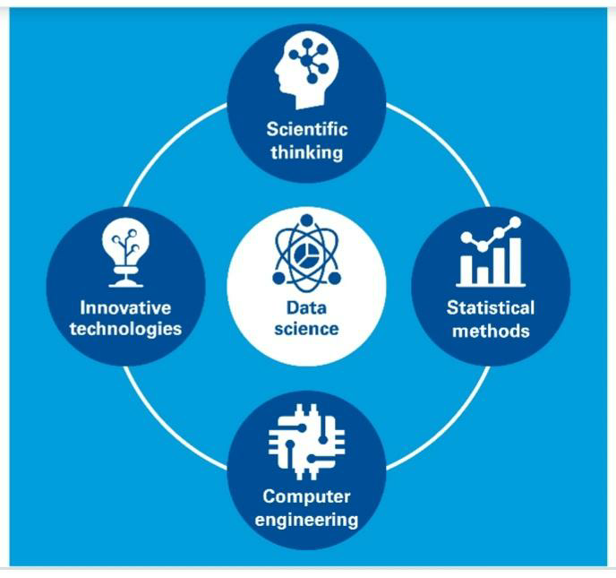

## What is DATA SCIENCE in simple words?

Data science is the field of study that combines domain expertise, programming skills, and knowledge of mathematics and statistics to extract meaningful insights from data. In turn, these systems generate insights which analysts and business users can translate into tangible business value.

## DATA SCIENCE PROCESS :

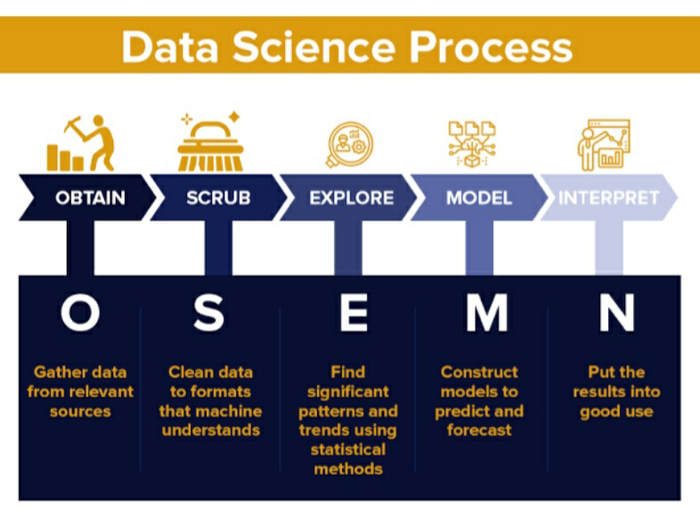

## LIFE CYCLE OF DATA SCIENCE:

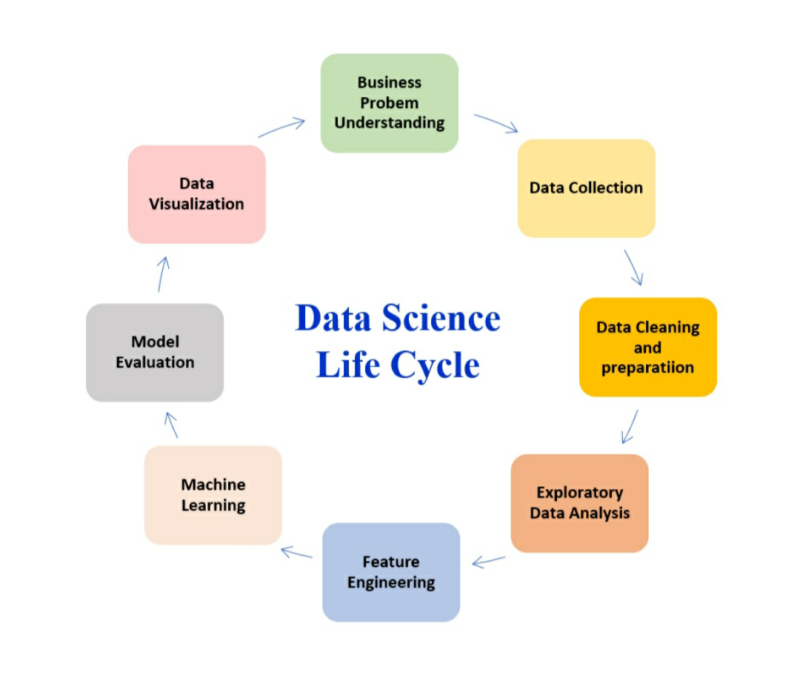

## Why is Data Science Important?

More and more companies are coming to realize the importance of data science, AI, and machine learning. Regardless of industry or size, organizations that wish to remain competitive in the age of big data need to efficiently develop and implement data science capabilities or risk being left behind.

## Data Science vs Data Analytics:

- While Data Science focuses on finding meaningful correlations between large datasets, Data Analytics is designed to uncover the specifics of extracted insights. 
- In other words, Data Analytics is a branch of Data Science that focuses on more specific answers to the questions that Data Science brings forth.

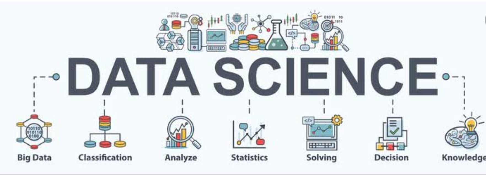

## Which is better: Data Science or Data Analytics?

- Data analysis works better when it is focused, having questions in mind that need answers based on existing data. 
- Data science produces broader insights that concentrate on which questions should be asked, while big data analytics emphasizes discovering answers to questions being asked

- Hence, Data Science is a field of analyzing and picking insightful information from raw data. 
- A Data Scientist is one who creates programming code and combines it with statistical knowledge to create insights and analysis on relatively larger data or big data.

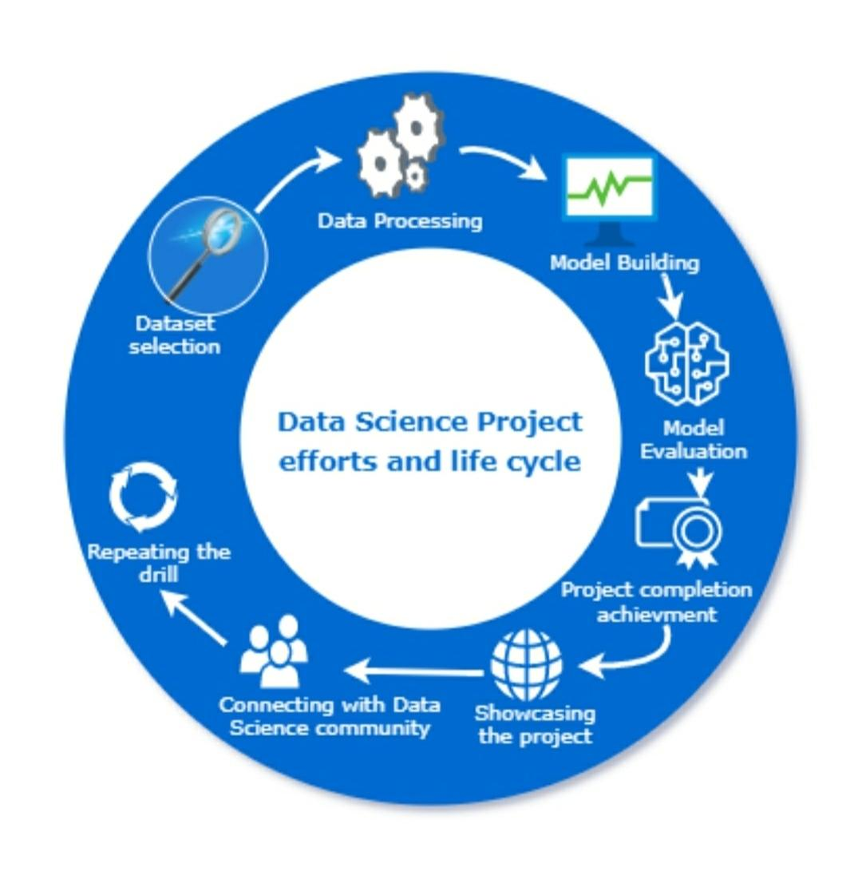

## Skills required for a Data Scientist are:

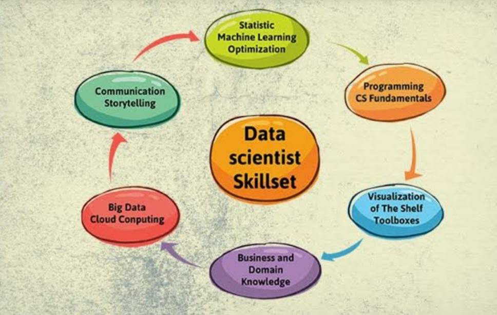

- Mathematics
- Statistics
- Data Processing
- Data Analysis
- Computer Science/Programming
- Machine Learning

In the image below you can see a Venn Diagram showing how fields are interlinked.

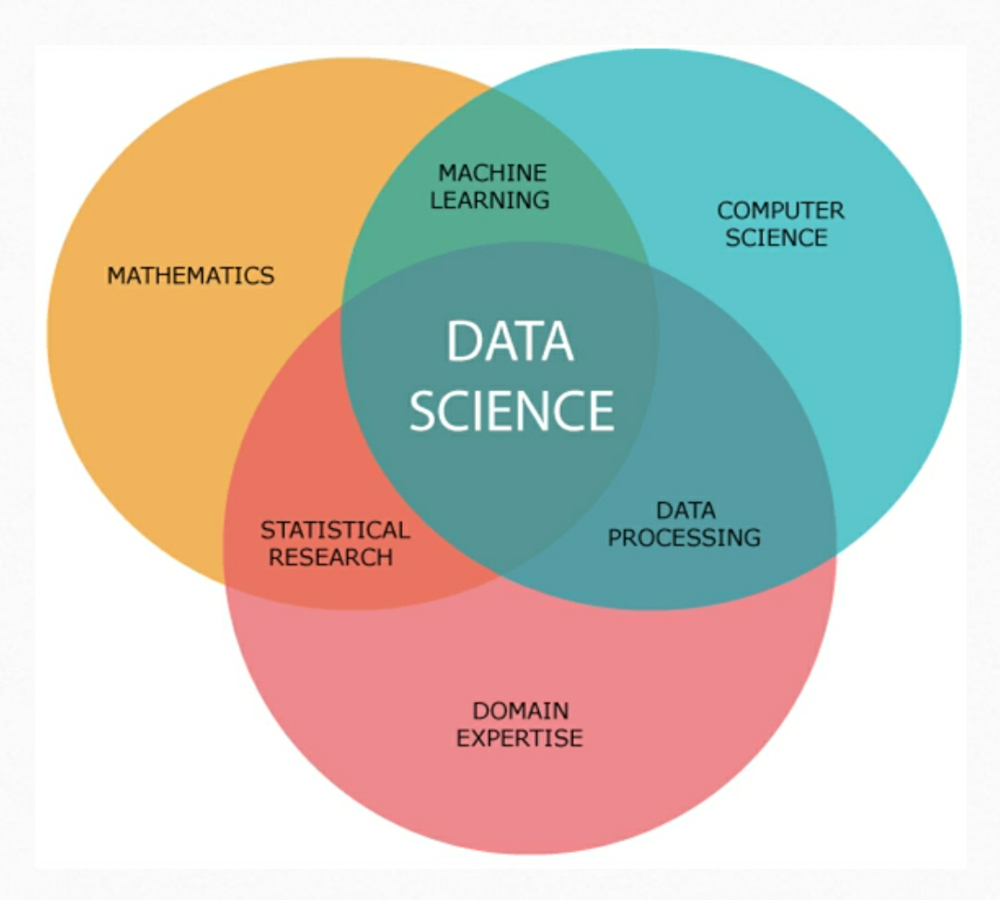

## APPLICATIONS OF DATA SCIENCE:

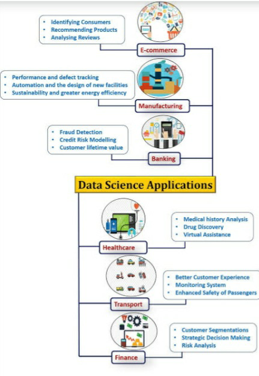

## APPLICATIONS IN DIFFERENT FIELDS:

1. **INTERNET SEARCH:**
- All the Search engines make use of data science algorithms to deliver one of the best results for our searched thing in a fraction of second.

` `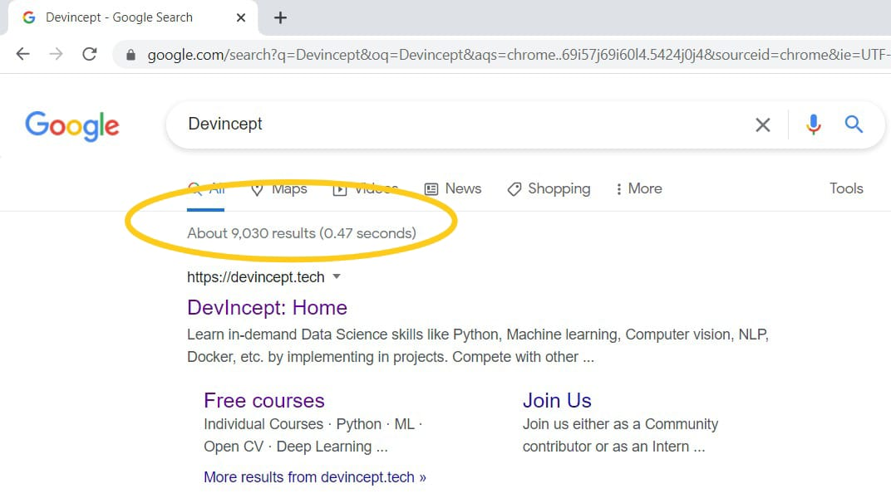

2. **DIGITAL ADVERTISEMENT:**
- Search is the biggest application of data science and machine learning. From displaying advertisements on various websites to the digital bill at the airport, everything is decided by using data science algorithms.
- Digital Ads: Get a lot of higher CTR [Click Through Rate] than traditional ads.

3. **RECOMMENDER SYSTEM:**
   - Everyone is familiar with recommendations on YouTube, Amazon, Flipkart, Netflix etc. 
   - They not only help to search relevant products but also for advertisements that are to make us buy that product.
   - Companies use this to promote their products. Most recommendations are based on previous search results.                                
4. **IMAGE RECOGNITION:**
   - We used to upload images with friends in social media and we get suggestions to tag our friends. This automatic tag suggestion uses a face recognition algorithm.
   - Similarly, it is asked to scan the QR code when we open WhatsApp in a Web browser.
5. **SPEECH RECOGNITION:**
   - Some of the best examples are Google Voice Assistant, Siri, Cortana etc. 
   - This also uses a Data Science algorithm. 
   - (Here you can see a video conversation between Cortana and Satya Nadella (Microsoft CEO).
   - [Link: https://youtu.be/HdKGo9IgWOA]

## ROLES IN DATA SCIENCE :

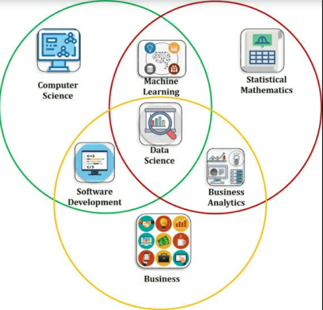

 #### There are three different roles in Data Science.

- Data Engineer
- Data Analyst
- Data Scientist

|**Data Engineer**|**Data Analyst**|**Data Scientist**|
| :-: | :-: | :-: |
|Focus on improving data consumption techniques|Focus on the present technical analysis of data.|Focuses on a futuristic display of data.|
|Data mining for getting insights from data.|Collecting information from a database with the help of a query.|
Manage, mine, and clean unstructured data to prepare it for practical use. 

|
|Prepare data, construct, test, maintain complete architecture.|Analyze numeric data and help to make decisions.|Analyze and interpret complex data.|
|Scripting, reporting and data visualization.|Spreadsheet knowledge|Decision making soft skills.|
|
Writing queries on data

|
Use basic algorithms in their work like logistic regression, linear regression and so on

|
Understand and interpret Big Data analysis

|

