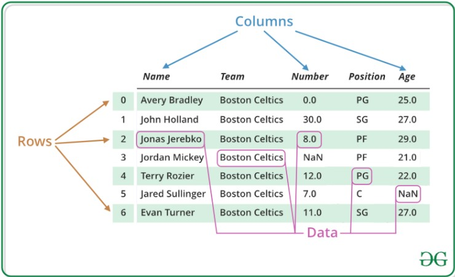
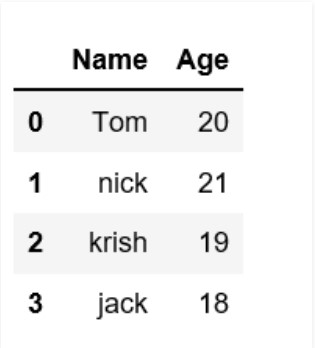
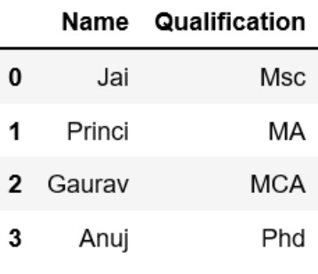
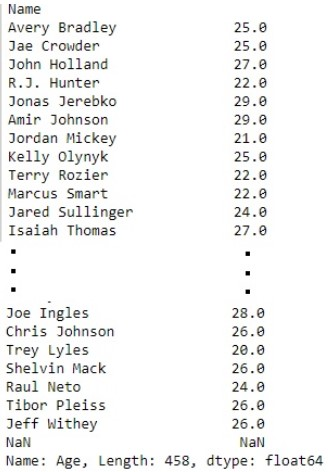
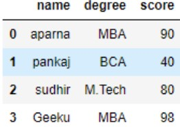

## Pandas Dataframe
Pandas DataFrame is two-dimensional size-mutable, potentially heterogeneous tabular data structure with labeled axes (rows and columns). A Data frame is a two-dimensional data structure, i.e., data is aligned in a tabular fashion in rows and columns. Pandas DataFrame consists of three principal components, the data, rows, and columns.



We will get a brief insight on all these basic operation which can be performed on Pandas DataFrame :
* Creating a DataFrame
* Dealing with Rows and Columns
* Indexing and Selecting Data
* Working with Missing Data
* Iterating over rows and columns

### Creating a Pandas DataFrame
In the real world, a Pandas DataFrame will be created by loading the datasets from existing storage, storage can be SQL Database, CSV file, and Excel file. Pandas DataFrame can be created from the lists, dictionary, and from a list of dictionary etc. Dataframe can be created in different ways here are some ways by which we create a dataframe:<br>

**Creating a dataframe using List:**  DataFrame can be created using a single list or a list of lists.
```python
# import pandas as pd
import pandas as pd
 
# list of strings
lst = ['Geeks', 'For', 'Geeks', 'is', 'portal', 'for', 'Geeks']
 
# Calling DataFrame constructor on list
df = pd.DataFrame(lst)
print(df)
```

**Output**


**Creating DataFrame from dict of narray/lists:** To create DataFrame from dict of narray/list, all the narray must be of same length. If index is passed then the length index should be equal to the length of arrays. If no index is passed, then by default, index will be range(n) where n is the array length.
```python
# Python code demonstrate creating 
# DataFrame from dict narray / lists 
# By default addresses.
 
import pandas as pd
 
# intialise data of lists.
data = {'Name':['Tom', 'nick', 'krish', 'jack'], 'Age':[20, 21, 19, 18]}
 
# Create DataFrame
df = pd.DataFrame(data)
 
# Print the output.
print(df)
```

**Output**



### Dealing with Rows and Columns
A Data frame is a two-dimensional data structure, i.e., data is aligned in a tabular fashion in rows and columns. We can perform basic operations on rows/columns like selecting, deleting, adding, and renaming.<br>

**Column Selection:** In Order to select a column in Pandas DataFrame, we can either access the columns by calling them by their columns name.
```python
# Import pandas package
import pandas as pd
 
# Define a dictionary containing employee data
data = {'Name':['Jai', 'Princi', 'Gaurav', 'Anuj'], 'Age':[27, 24, 22, 32], 'Address':['Delhi', 'Kanpur', 'Allahabad', 'Kannauj'],
        'Qualification':['Msc', 'MA', 'MCA', 'Phd']}
 
# Convert the dictionary into DataFrame 
df = pd.DataFrame(data)
 
# select two columns
print(df[['Name', 'Qualification']])
```

**Output**



**Row Selection:** Pandas provide a unique method to retrieve rows from a Data frame. DataFrame.loc[] method is used to retrieve rows from Pandas DataFrame. Rows can also be selected by passing integer location to an iloc[] function.
```python
# importing pandas package
import pandas as pd
 
# making data frame from csv file
data = pd.read_csv("nba.csv", index_col ="Name")
 
# retrieving row by loc method
first = data.loc["Avery Bradley"]
second = data.loc["R.J. Hunter"]
 
print(first, "\n\n\n", second)
```

**Output**


### Indexing and Selecting Data
Indexing in pandas means simply selecting particular rows and columns of data from a DataFrame. Indexing could mean selecting all the rows and some of the columns, some of the rows and all of the columns, or some of each of the rows and columns. Indexing can also be known as Subset Selection.<br>

**Indexing a Dataframe using indexing operator [] :**<br>
Indexing operator is used to refer to the square brackets following an object. The .loc and .iloc indexers also use the indexing operator to make selections. In this indexing operator to refer to df[].<br>
**Selecting a single columns:** In order to select a single column, we simply put the name of the column in-between the brackets
```python
# importing pandas package
import pandas as pd
 
# making data frame from csv file
data = pd.read_csv("nba.csv", index_col ="Name")
 
# retrieving columns by indexing operator
first = data["Age"]

print(first)
```

**Output**



**Indexing a DataFrame using .loc[ ] :**<br>
This function selects data by the label of the rows and columns. The df.loc indexer selects data in a different way than just the indexing operator. It can select subsets of rows or columns. It can also simultaneously select subsets of rows and columns.<br>
**Selecting a single row:** In order to select a single row using .loc[], we put a single row label in a .loc function.
```python
# importing pandas package
import pandas as pd
 
# making data frame from csv file
data = pd.read_csv("nba.csv", index_col ="Name")
 
# retrieving row by loc method
first = data.loc["Avery Bradley"]
second = data.loc["R.J. Hunter"]
 
print(first, "\n\n\n", second)
```

**Output**<br>
As shown in the output image, two series were returned since there was only one parameter both of the times.


**Indexing a DataFrame using .iloc[ ] :**<br>
This function allows us to retrieve rows and columns by position. In order to do that, we’ll need to specify the positions of the rows that we want, and the positions of the columns that we want as well. The df.iloc indexer is very similar to df.loc but only uses integer locations to make its selections.<br>
**Selecting a single row:** In order to select a single row using .iloc[], we can pass a single integer to .iloc[] function.
```python
import pandas as pd
 
# making data frame from csv file
data = pd.read_csv("nba.csv", index_col ="Name")
 
# retrieving rows by iloc method 
row2 = data.iloc[3] 
 
print(row2)
```

**Output**


### Working with Missing Data
Missing Data can occur when no information is provided for one or more items or for a whole unit. Missing Data is a very big problem in real life scenario. Missing Data can also refer to as NA(Not Available) values in pandas.<br>
**Checking for missing values using isnull() and notnull() :** In order to check missing values in Pandas DataFrame, we use a function isnull() and notnull(). Both function help in checking whether a value is NaN or not. These function can also be used in Pandas Series in order to find null values in a series.
```python
# importing pandas as pd
import pandas as pd
 
# importing numpy as np
import numpy as np
 
# dictionary of lists
dict = {'First Score':[100, 90, np.nan, 95], 'Second Score': [30, 45, 56, np.nan], 'Third Score':[np.nan, 40, 80, 98]}
 
# creating a dataframe from list
df = pd.DataFrame(dict)
 
# using isnull() function  
df.isnull()
```

**Output**


**Filling missing values using fillna(), replace() and interpolate() :** In order to fill null values in a datasets, we use fillna(), replace() and interpolate() function these function replace NaN values with some value of their own. All these function help in filling a null values in datasets of a DataFrame. Interpolate() function is basically used to fill NA values in the dataframe but it uses various interpolation technique to fill the missing values rather than hard-coding the value.
```python
# importing pandas as pd
import pandas as pd
 
# importing numpy as np
import numpy as np
 
# dictionary of lists
dict = {'First Score':[100, 90, np.nan, 95], 'Second Score': [30, 45, 56, np.nan], 'Third Score':[np.nan, 40, 80, 98]}
 
# creating a dataframe from dictionary
df = pd.DataFrame(dict)
 
# filling missing value using fillna()  
df.fillna(0)
```

**Output**


**Dropping missing values using dropna() :** In order to drop a null values from a dataframe, we used dropna() function this fuction drop Rows/Columns of datasets with Null values in different ways.
```python
# importing pandas as pd
import pandas as pd
 
# importing numpy as np
import numpy as np
 
# dictionary of lists
dict = {'First Score':[100, 90, np.nan, 95], 'Second Score': [30, np.nan, 45, 56], 'Third Score':[52, 40, 80, 98], 'Fourth Score':[np.nan, np.nan, np.nan, 65]}
 
# creating a dataframe from dictionary
df = pd.DataFrame(dict)

# using dropna() function 
df
```

**Output**


### Iterating over rows and columns
Iteration is a general term for taking each item of something, one after another. Pandas DataFrame consists of rows and columns so, in order to iterate over dataframe, we have to iterate a dataframe like a dictionary.<br>

**Iterating over rows :** In order to iterate over rows, we can use three function iteritems(), iterrows(), itertuples() . These three function will help in iteration over rows.
```python
# importing pandas as pd
import pandas as pd
  
# dictionary of lists
dict = {'name':["aparna", "pankaj", "sudhir", "Geeku"], 'degree': ["MBA", "BCA", "M.Tech", "MBA"], 'score':[90, 40, 80, 98]}
 
# creating a dataframe from a dictionary 
df = pd.DataFrame(dict)
 
print(df)
```

**Output**



**Iterating over Columns :** In order to iterate over columns, we need to create a list of dataframe columns and then iterating through that list to pull out the dataframe columns.
```python
# importing pandas as pd
import pandas as pd
   
# dictionary of lists
dict = {'name':["aparna", "pankaj", "sudhir", "Geeku"], 'degree': ["MBA", "BCA", "M.Tech", "MBA"], 'score':[90, 40, 80, 98]}
  
# creating a dataframe from a dictionary 
df = pd.DataFrame(dict)
 
print(df)
```

**Output**


