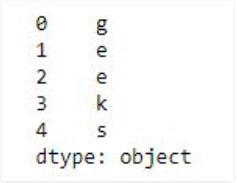
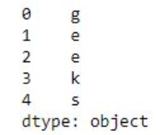
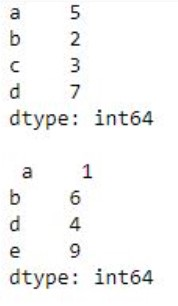

# Pandas Series
Pandas Series is a one-dimensional labeled array capable of holding data of any type (integer, string, float, python objects). The axis labels are collectively called index. Pandas Series is nothing but a column in an excel sheet.
Labels need not be unique but must be a hashable type. The object supports both integer and label-based indexing and provides a host of methods for performing operations involving the index.


We will get a brief insight on all these basic operations which can be performed on Pandas Series :
* Creating a Series
* Accessing element of Series
* Indexing and Selecting Data in Series
* Binary operation on Series
* Conversion Operation on Series

### Creating a Pandas Series
In the real world, a Pandas Series will be created by loading the datasets from existing storage, storage can be SQL Database, CSV file, and Excel file. Pandas Series can be created from the lists, dictionary, and from a scalar value etc. Series can be created in different ways, here are some ways by which we create a series:<br>

**Creating a series from array:** In order to create a series from array, we have to import a numpy module and have to use array() function.
```python
# import pandas as pd
import pandas as pd
 
# import numpy as np
import numpy as np
 
# simple array
data = np.array(['g','e','e','k','s'])
 
ser = pd.Series(data)
print(ser)
```

**Output**



**Creating a series from Lists:** In order to create a series from list, we have to first create a list after that we can create a series from list.
```python
import pandas as pd
 
# a simple list
list = ['g', 'e', 'e', 'k', 's']
  
# create series form a list
ser = pd.Series(list)
print(ser)
```

**Output**


### Accessing element of Series
There are two ways through which we can access element of series, they are :
* Accessing Element from Series with Position
* Accessing Element Using Label (index)

**Accessing Element from Series with Position :** In order to access the series element refers to the index number. Use the index operator [ ] to access an element in a series. The index must be an integer. In order to access multiple elements from a series, we use Slice operation.<br>
Accessing first 5 elements of Series
```python
# import pandas and numpy 
import pandas as pd
import numpy as np
 
# creating simple array
data = np.array(['g', 'e', 'e', 'k', 's', 'f', 'o', 'r', 'g', 'e', 'e', 'k', 's'])
ser = pd.Series(data)
  
#retrieve the first element
print(ser[:5])
```

**Output**



**Accessing Element Using Label (index) :** In order to access an element from series, we have to set values by index label. A Series is like a fixed-size dictionary in that you can get and set values by index label.<br>
Accessing a single element using index label
```python
# import pandas and numpy 
import pandas as pd
import numpy as np
 
# creating simple array
data = np.array(['g', 'e', 'e', 'k', 's', 'f', 'o', 'r', 'g', 'e', 'e', 'k', 's'])
ser = pd.Series(data,index=[10, 11, 12, 13, 14, 15, 16, 17, 18, 19, 20, 21, 22])
  
# accessing a element using index element
print(ser[16])
```

**Output**


### Indexing and Selecting Data in Series
Indexing in pandas means simply selecting particular data from a Series. Indexing could mean selecting all the data, some of the data from particular columns. Indexing can also be known as Subset Selection.<br>

**Indexing a Series using indexing operator [] :** Indexing operator is used to refer to the square brackets following an object. The .loc and .iloc indexers also use the indexing operator to make selections. In this indexing operator to refer to df[ ].
```python
# importing pandas module  
import pandas as pd  
     
# making data frame  
df = pd.read_csv("nba.csv")  
   
ser = pd.Series(df['Name']) 
data = ser.head(10)
data 
```

**Output**


**Indexing a Series using .loc[ ] :** This function selects data by refering the explicit index . The df.loc indexer selects data in a different way than just the indexing operator. It can select subsets of data.
```python
# importing pandas module  
import pandas as pd  
     
# making data frame  
df = pd.read_csv("nba.csv")  
   
ser = pd.Series(df['Name']) 
data = ser.head(10)
data 
```

**Output**


**Indexing a Series using .iloc[ ] :** This function allows us to retrieve data by position. In order to do that, we’ll need to specify the positions of the data that we want. The df.iloc indexer is very similar to df.loc but only uses integer locations to make its selections.
```python
# importing pandas module  
import pandas as pd  
     
# making data frame  
df = pd.read_csv("nba.csv")  
   
ser = pd.Series(df['Name']) 
data = ser.head(10)
data 
```

**Output**


### Binary Operation on Series
We can perform binary operation on series like addition, subtraction and many other operation. In order to perform binary operation on series we have to use some function like .add(),.sub() etc.
```python
# importing pandas module  
import pandas as pd  
 
# creating a series
data = pd.Series([5, 2, 3,7], index=['a', 'b', 'c', 'd'])
 
# creating a series
data1 = pd.Series([1, 6, 4, 9], index=['a', 'b', 'd', 'e'])
 
print(data, "\n\n", data1)
```

**Output**



### Conversion Operation on Series
In conversion operation we perform various operation like changing datatype of series, changing a series to list etc. In order to perform conversion operation we have various function which help in conversion like .astype(), .tolist() etc.
```python
# importing pandas module  
import pandas as pd 
   
# reading csv file from url  
data = pd.read_csv("nba.csv") 
    
# dropping null value columns to avoid errors 
data.dropna(inplace = True) 
   
# storing dtype before converting 
before = data.dtypes 
   
# converting dtypes using astype 
data["Salary"]= data["Salary"].astype(int) 
data["Number"]= data["Number"].astype(str) 
   
# storing dtype after converting 
after = data.dtypes 
   
# printing to compare 
print("BEFORE CONVERSION\n", before, "\n") 
print("AFTER CONVERSION\n", after, "\n") 
```

**Output**


